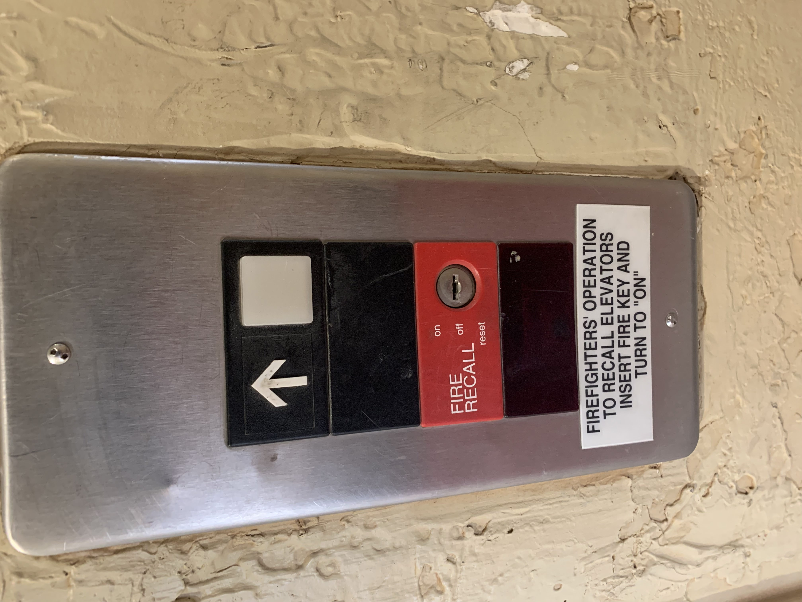

# Elevator Interface

**Real Life Example**

**Issues with Design**

- Outside Elevator Panel does not indicate which direction the elevator is traveling when the elevator is already in use
- Alarm button looks like a hanging light button
- Lack of Audio when selection of any floor on the inside control Panel

**Explanation of Issues**

- By not indicating which direction the elevator is traveling, a user could get on a downwards traveling elevator when they want to travel up
- This confusing image makes a user confused on functionality of that specific button
- Without an audio que, a user does not know if button was properly selected. Especially if the user is blind

**Common/Rare Use Cases**

- Fast way to travel between floors in a building
- Allows for users in a wheelchair to travel up floors in a building
-

**Common Sequence of Actions**
