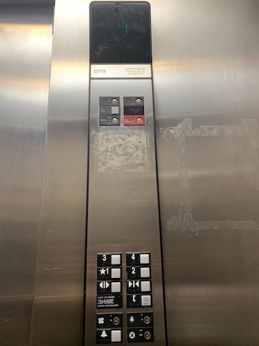
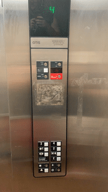
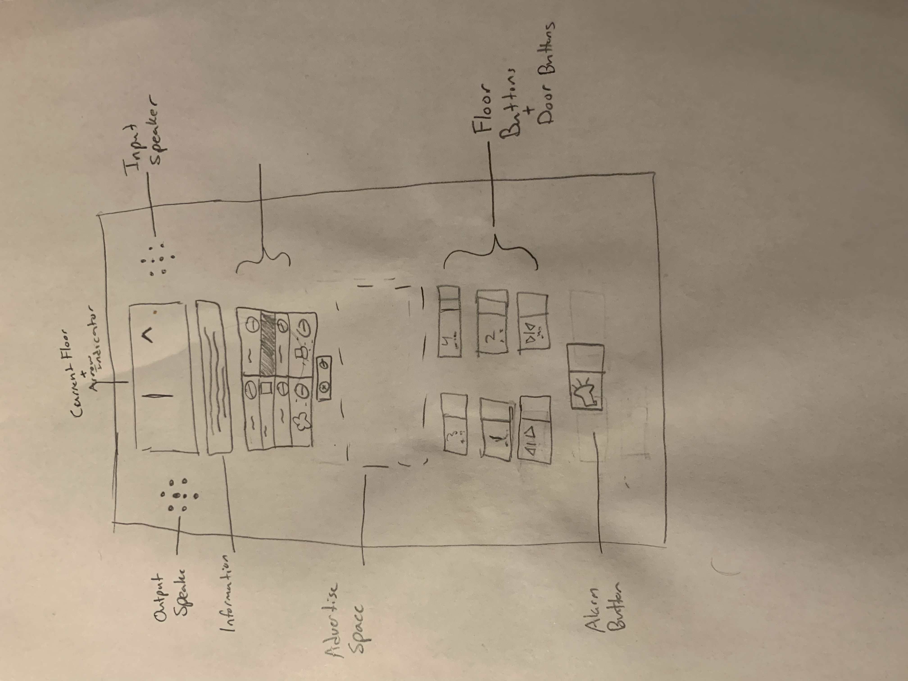

# Elevator Interface

**Real Life Example**

**Issues with Design**

- Alarm button looks like a hanging light button
- Lack of Audio when selection of any floor

**Explanation of Issues**

- This confusing image makes a user confused on functionality of that specific button
- Without an audio cue, a user does not know if button was properly selected. Especially if the user is blind

**Common/Rare Use Cases**

- Fast way to travel between floors in a building
- Allows for users in a wheelchair to travel up floors in a building
- Moving large loads/furniture up and down a building

**Common Sequence of Actions**

- Press outside button to call the elevator
- Walk into the elevator
- Select floor option by pressing a button
- Arrive at floor and leave elevator

**Feeback to User with Current Design**

- The grouping of the buttons and the black backround makes it easy to see which label goes with what button
- The brail next to the button allows blind users to read what each button is for
- The screen allows person to understand what floor they are currently at

**Common Errors Made with Design**

- Get on the elevator traveling the wrong direction due to a lack of display on elevator traveling direction

**Redesign**

**Touch Screen Design**

- Screen Size: 12.1 x 20.2
- Link: https://xd.adobe.com/view/b496f54a-1251-4e52-6b76-6faffe756ed4-c2a7/

**Supports Disabilities**

- My design supports wheelchair access people. The buttons below the screen allow for people who cant reach the screen to be able to still easily navigate the elevator's control panel

**Extra Info on Display**

- The companies name of where he elevator is located
- The current floor of the elveator
- An easy maintance button and screen
- An info screen with directions

**Extra Unique Features (Imagination)**

- Voice commands (not implemented in the demo)
